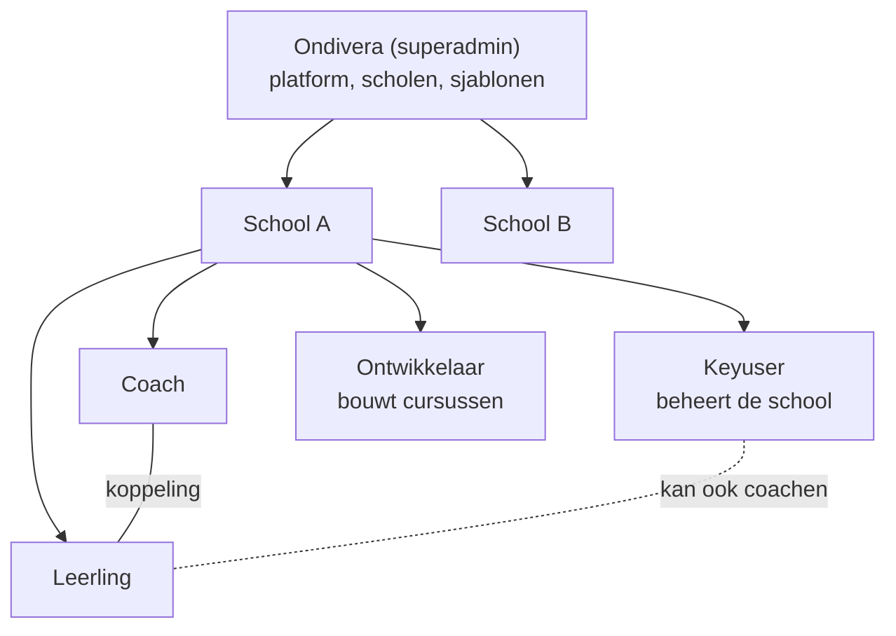
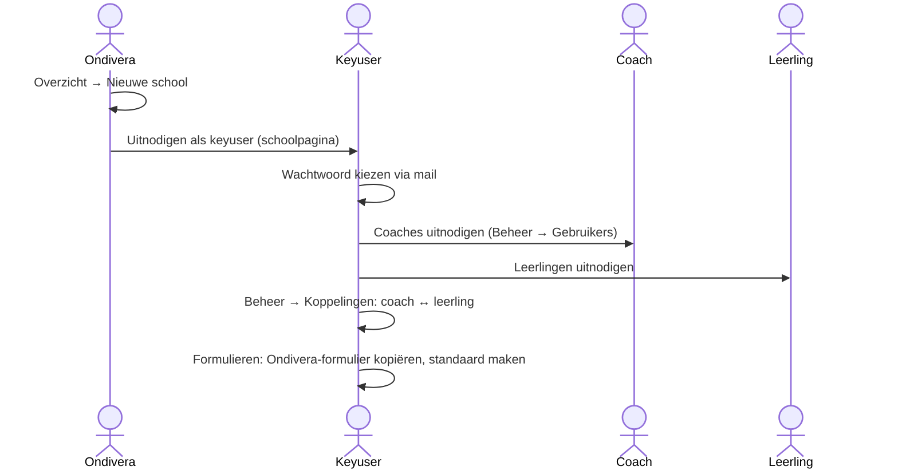
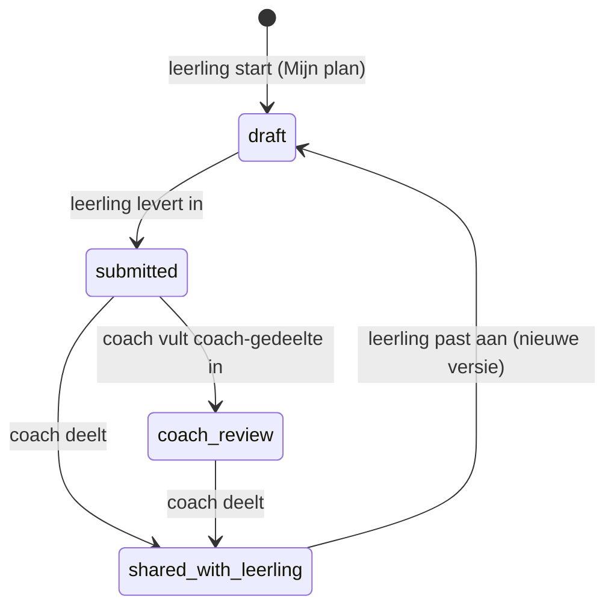
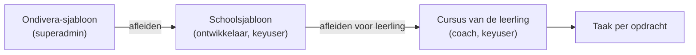

# Incluvo — rollen en flows

Hoe Incluvo in elkaar zit en hoe het werk door de app loopt, zoals de code het
op 01-10-2026 doet. Onderaan: wat beter kan.

Zie ook `docs/decisions/superadmin-beheer.md` (rollen en toegang) en
`docs/decisions/bewaartermijnen.md`.

---

## 1. Het plaatje

- **Een organisatie** is Ondivera (één) of een school. Iedere gebruiker hoort bij
  precies één organisatie.
- **Ondivera** beheert het platform: scholen, sjablonen voor het coachplan en voor
  cursussen. Het begeleidt geen leerlingen en ziet hun gegevens niet.
- **De school** is eigenaar van de leerlinggegevens (verwerkingsverantwoordelijke).
- **De koppeling** coach ↔ leerling bepaalt wie een leerling begeleidt: alleen
  gekoppelde coaches zien plan, taken, cursus, stemming en chat van die leerling.

### Rollen

| Rol | Wie | Startpagina | Menu |
| --- | --- | --- | --- |
| superadmin | Ondivera | Overzicht (alle scholen) | Overzicht, Cursussen, Beheer, Formulieren |
| keyuser | beheerder van een school | Dashboard | Dashboard, Coachplannen, Cursussen, Chat, Assistent, Beheer, Formulieren |
| coach | coach / docent | Dashboard | Dashboard, Coachplannen, Cursussen, Chat, Assistent |
| ontwikkelaar | bouwt cursussen voor de school | Cursussen | Cursussen, Mijn profiel |
| leerling | leerling (8–20 jaar) | Welkom | Welkom, Mijn taken, Cursussen, Mijn plan, Chat, Mijn profiel |

### Wie mag wat

| | superadmin | keyuser | coach | ontwikkelaar | leerling |
| --- | --- | --- | --- | --- | --- |
| Scholen aanmaken, archiveren | ✔ | | | | |
| Gebruikers uitnodigen, rollen | alle scholen | eigen school | | | |
| Koppelingen coach ↔ leerling | alle scholen | eigen school | | | |
| Coachplan-formulier beheren | Ondivera-sjabloon | schoolformulier | | | |
| Cursussjabloon bouwen | Ondivera-sjabloon | schoolsjabloon | | schoolsjabloon | |
| Leerling: plan, taken, cursus, stemming | | hele school | gekoppelde leerlingen | | eigen |
| 1-op-1-chat | | gekoppelde leerlingen | gekoppelde leerlingen | | eigen coaches |
| AI-advies, transcriptie | | ✔ | ✔ | | |
| Audit-log | alles | eigen school | | | |

Server: `packages/permissions` (`sameTenant`, `sameSchool`, `coachesLeerlingen`,
`canAccessLeerling`) en `apps/server/src/access.ts`. De UI-guards
(`requireRole`, `<RequireRole>`) zijn alleen gemak; de server beslist.

---

## 2. Flows

### A. Een school aansluiten

1. **Ondivera** maakt de school aan; de schoolpagina toont "Volgende stap: nodig de
   keyuser uit" en het uitnodigformulier staat al op keyuser.
2. **Uitnodiging:** account zonder wachtwoord + mail met een link (7 dagen geldig)
   naar `/wachtwoord-instellen`. Zelf registreren kan niet.
3. **Keyuser** nodigt coaches en leerlingen uit en legt de koppelingen
   (filter "Zonder coach").
4. **Formulier:** de keyuser kopieert het Ondivera-coachplan naar de school
   (`templates.copyToSchool`) en maakt het de standaard.
5. **Cursussen:** de keyuser of ontwikkelaar maakt van een Ondivera-cursussjabloon
   een schoolsjabloon (`courses.derive`).

Een school stoppen: **Archiveren** op de schoolpagina — iedereen wordt uitgelogd,
inloggen en uitnodigen kan niet meer, de gegevens blijven. **Herstellen** maakt
het ongedaan.

### B. Het coachplan

1. **Leerling vult in** (`/plan`): een wizard die elk antwoord direct opslaat. Per
   vraag kan de leerling "overslaan" of "bespreken met coach" aangeven.
2. **Inleveren:** antwoorden die aan een coachvraag gekoppeld zijn, worden alvast in
   het coach-gedeelte gezet. Gekoppelde coaches krijgen een melding.
3. **Coach beoordeelt** (Coachplannen → plan): vult het coach-gedeelte (POPP) in,
   eventueel met:
   - **transcriptie** van een gesprek → conceptantwoorden om over te nemen;
   - **AI-advies** in de zijbalk (UDL, op basis van plan en kennisdocumenten; de
     naam van de leerling gaat niet mee);
   - **leervoorkeuren** vastleggen; "afgestemd met ouders" aanvinken.
4. **Delen:** de versie wordt "het plan" van de leerling; de leerling krijgt een
   melding en kan een PDF downloaden. Leervoorkeuren bepalen welke cursusinhoud
   als aanbevolen wordt getoond.
5. **Aanpassen:** de leerling start een nieuwe versie (antwoorden gaan mee); het
   gedeelde plan blijft geldig tot de volgende keer delen.

Formulieren hebben versies: een formulier dat in gebruik is, verandert niet; je
maakt een nieuwe versie. Een nieuwe Ondivera-versie kan een school overnemen
("bijwerken vanaf bron").

### C. Cursussen

1. **Bouwen:** secties en blokken (tekst, media, bestand, opdracht), met labels per
   leervoorkeur.
2. **Afleiden voor een leerling** maakt een eigen kopie; elke opdracht wordt een
   taak in de takenlijst van de leerling.
3. **Leerling werkt:** voortgang per blok; aanbevolen inhoud volgens de
   leervoorkeuren uit het gedeelde plan.
4. **Opdracht inleveren** (tekst en/of bestanden) → de taak staat op klaar.
5. **Coach beoordeelt** met feedback → de leerling krijgt een melding.
6. **Eigen opdracht voorstellen** (leerling) → coach accepteert of wijst af.
7. **Bron gewijzigd:** als het Ondivera-sjabloon verandert, ziet de school dat en kan
   een nieuwe kopie maken.

### D. Taken

- Leerling ziet **Vandaag** (vandaag of vastgepind), **Toekomst** en **Klaar**;
  kan zelf taken toevoegen, afvinken en vastpinnen.
- Coach of keyuser beheert de takenlijst van een leerling (profiel → Taken), kan
  taken toevoegen (leerling krijgt een melding) en de lijst tijdelijk verbergen.
- Taken uit een cursusopdracht gaan op klaar door in te leveren, niet door afvinken.

### E. Chat en meldingen

- **1-op-1-chat** alleen tussen een leerling en een gekoppelde coach of keyuser.
- **Meldingen** (bel rechtsboven, realtime):

| Melding | Wanneer | Voor |
| --- | --- | --- |
| Coachplan ingeleverd | leerling levert in | gekoppelde coaches |
| Coachplan gedeeld | coach deelt | leerling |
| Nieuwe taak | coach voegt een taak toe | leerling |
| Opdracht beoordeeld | coach geeft feedback | leerling |
| Nieuw bericht | chatbericht | de ander |

### F. Hoe gaat het vandaag (stemming)

De leerling kiest op Welkom hoe het gaat en kiest zelf of de coach dat mag zien.
De coach ziet alleen gedeelde stemmingen (dashboard, profiel).

### G. Privacy en beheer

- Leerlinggegevens worden voorlopig **onbeperkt bewaard**; opnames worden niet
  opgeslagen; de audit-log 730 dagen.
- De **audit-log** legt vast wie wat wijzigde (zonder de inhoud van antwoorden).
- **AI** alleen via een EU-aanbieder; het plan gaat als gemarkeerde gegevens mee,
  de naam van de leerling niet.

---

## 3. Wat kan beter

### Moet — fouten en lekken

1. **Een leerling kan antwoorden in het coach-gedeelte schrijven.** `saveAnswer`
   (`coachplan/index.ts:793`) controleert niet of de vraag bij het leerlinggedeelte
   hoort. Via de API kan een leerling dus het POPP van de coach invullen (ook
   in een nieuwe versie, waar die antwoorden worden meegenomen).
2. **Meldingen volgen alleen de koppeling.** Een leerling zonder gekoppelde coach
   levert een plan in en niemand krijgt een melding; de keyuser ziet alle plannen
   maar krijgt alleen meldingen voor leerlingen aan wie hij gekoppeld is.
3. **"Takenlijst verbergen" bij meerdere coaches** schrijft op een willekeurige
   koppeling (`tasks/index.ts:~124`), dus de instelling is onbetrouwbaar zodra een
   leerling twee coaches heeft.
4. **Verouderde commentaren** zeggen nog dat de superadmin leerlingen ziet
   (`coachplan/index.ts:~1124`, `chat/index.ts:93`).

### Moet voor livegang — gaten in de flow

5. **Taken over tijd** vallen onder "Toekomst": er is geen "Te laat". Het
   dashboard telt ze wel als "over tijd". De melding "taak voor vandaag"
   (`task_due_today`) wordt nooit verstuurd.
6. **Coach krijgt geen melding** bij een ingeleverde opdracht, een voorstel van de
   leerling of een "bespreken met coach".
7. **Server kan het, scherm ontbreekt:**
   - een ander formulier voor één leerling (`assignToLeerling`);
   - een deadline van een taak verplaatsen (`tasks.setDueDate`);
   - een cursus, sectie of blok bewerken of verwijderen (`courses.update`,
     `updateBlock`, …) — labels zijn na het aanmaken niet meer te wijzigen;
   - chat als gelezen markeren (`chat.markRead`).
8. **Geaccepteerd voorstel doet niets:** het wordt geen opdracht en geen taak.
9. **Groepsgesprekken (forums, #6) bestaan niet:** er is geen bloktype en geen code
   die ze aanmaakt, terwijl het meelezen voor coaches wel is gebouwd.
10. **Nieuwe formulierversie** wordt niet vanzelf de standaard, en leerlingen met
    een eigen formulier blijven op de oude versie.
11. **Inleveren controleert verplichte vragen niet.**

### Kan — beter maken

12. **Coach kan een gedeeld plan niet heropenen**; alleen de leerling kan een
    nieuwe versie starten.
13. **Bron gewijzigd** biedt alleen "nieuwe kopie maken", geen bijwerken met
    behoud van wat de school aanpaste.
14. **Melding aanklikken** gaat alleen bij chatberichten naar de juiste plek.
15. **Stemming en "vandaag"** gebruiken de tijdzone van de server, niet
    Europe/Amsterdam.
16. **Dode statussen** opruimen: coachplan `completed`, inzending `draft` en
    `returned`, transcriptie `pending`, `ai.deleteAudio` (er wordt geen audio
    opgeslagen).

### Besluit nodig (Mark)

17. School verwijderen en leerlingen verplaatsen tussen scholen (wie wordt
    eigenaar van de historie?).
18. Groepsgesprekken: wel of niet in de eerste versie?
19. Supporttoegang voor Ondivera tot een school (met toestemming en audit-log).
